# Задание 1
Нам потребуется:
 - Docker
 - VS Code
 - Ngrok
 - Git

1. Клонируйте данный репозиторий к себе на Git.
2. Скопируйте к себе на компьютер Вашу копию даного проекта. В ней мы будем работать.
3. В файле node/service.py и node/config.yaml измените с Example на необходимые названия.
4. Запустите данный проект в VS Code, чтобы в Docker создался образ и контейнер.
5. Найдите текущий проект и его файлы в запущеном контейнере Docker.
6. Сделайте скриншот файлов которые нашли внутри контейнера и добавьте в README.md
7. Запустите Ngrok htpp на порту 9000. Сделайте его скриншот и добавьте в README.md

Ответ:

Сделала fork исходного репозитория. Изменила название с Example на TestApp.
Создала образ и запустила контейнер с проектом.
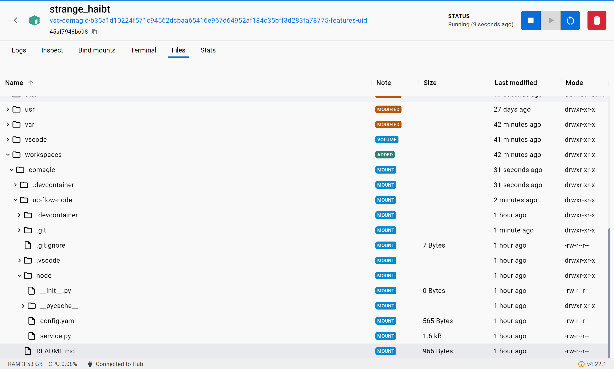
Затем установила ngrok и перенаправила запросы на 9000 порт.
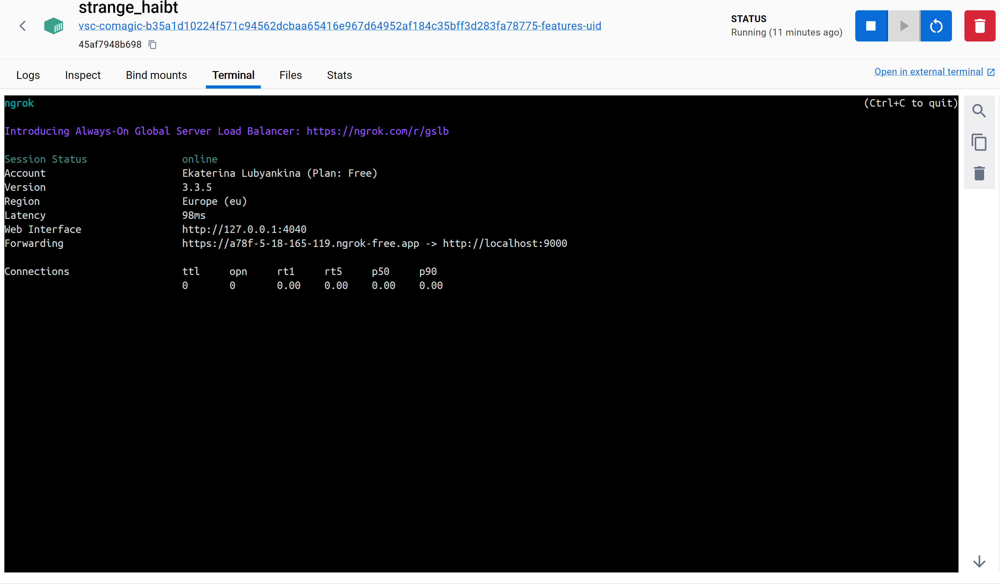
Запустила код на отладку.
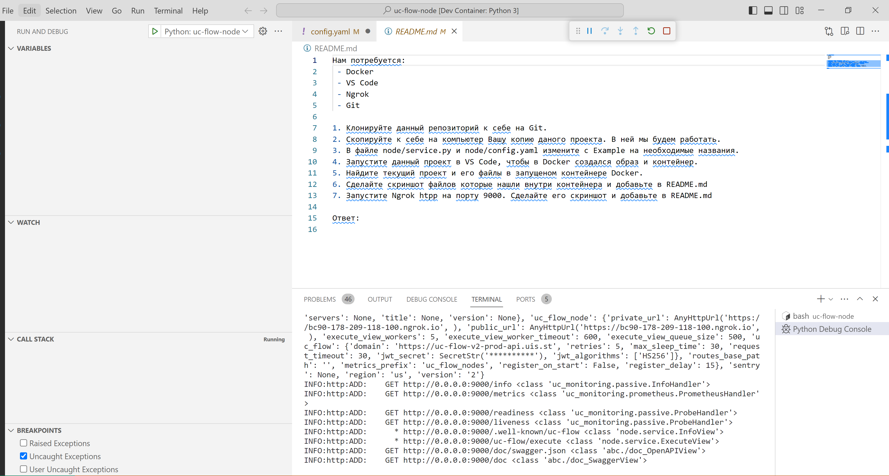

# Задание 2
У пользовательских полей, могут быть разные типы.

Создайте:
 1 текстовое поле
 1 числовое поле
 1 переключатель
 
 
От клиента в настроках сервиса, в тесктовое поле введите число
В числовом поле так же введите любое число.
Сервис должен вернуть сумму этих полей
Переключатель влияет на тип возвращаемых данных. Число/текст

## Результат:

Реализовала пользовательский интерфейс, где нужно ввести два числа (одно принимается как строка, другое как число) и выбрать формат ответа (строка, число).

Пример:

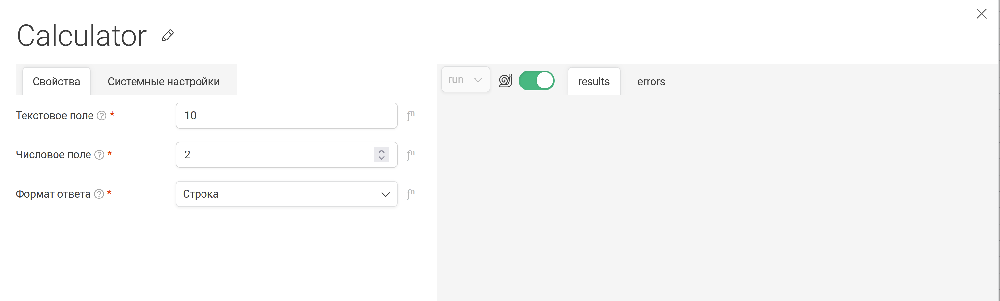

Ответ пользователю:
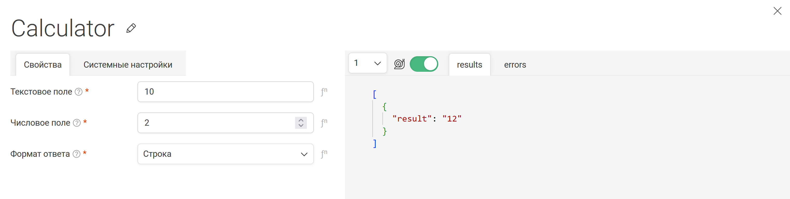

В реализации учтено, что пользователь в графе Текстовое поле может не ввести число, поэтому добавлен отдельный try-catch-else для контроля. 

# Задание 3
Основываясь на примере проекта Hollihop внесите изменение в созданный вами “кубик”.

Создайте поле - переключатель.

При положении переключателя во включено отобразите ниже два поля с выпадающим списком из двух значений (одинаковые в обоих полях):

“Значение 1”

“Значение 2”

При выборе одновременно одинаковых значений в списках отображается ниже:

“Значение 1”: Поле для ввода почты

“Значение 2”: Поле для ввода даты и времени

## Результат:

Реализовала интерфейс для "кубика" c переключателем.
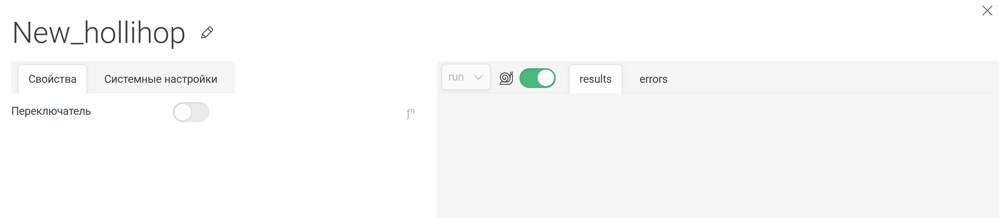

При включении переключателя появляются поля для выбора значений.
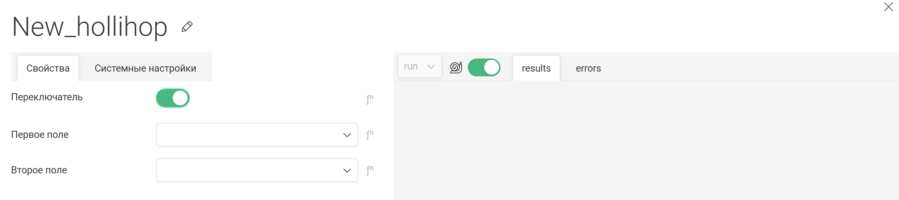

При выборе "Значения 1" появляется поле для ввода email.
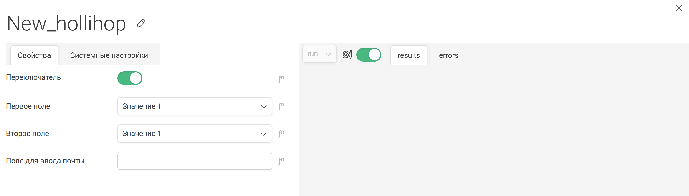

При выборе "Значение 2" появляется поле для ввода даты и времени

При выборе разных значений ничего не происходит.
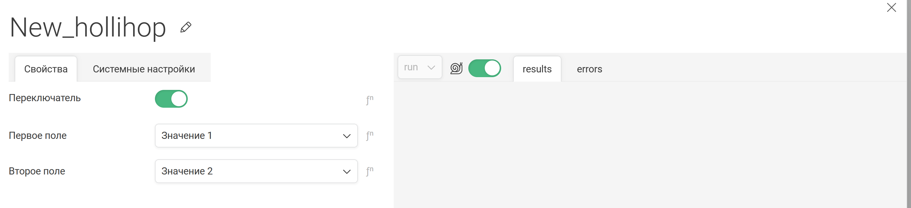

# Задание 4

Создать 2 сущности со всеми методами:

- Авторизация

- Customer

## Результат:

Реализовала кубик для интеграции с AlfaCRM.
Есть две опции: 
- Authentication - авторизация
- Customer - доступ к сущности customer

Необходимо использовать кубик дважды, чтобы выполнить запрос к customer.

В первом случае в кубике необходимо ввести параметры для авторизации: 
- имя хоста
- email
- ключ API (v2api)

Результат выполнения кубика:

{'token':'your alfacrm token'}

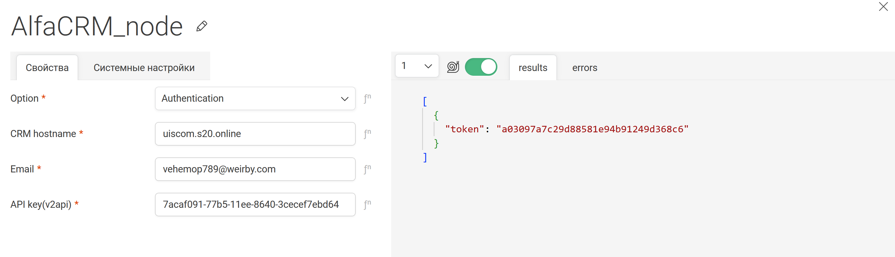

Во втором случае в кубике необходимо выбрать ввести host_name, тип операции (index, create, update) и id филиала(branch). В параметр токен нужно передать результат, полученный из первого кубика.

К запросу можно добавить параметры is_study, id, name, lead_status_id и page.

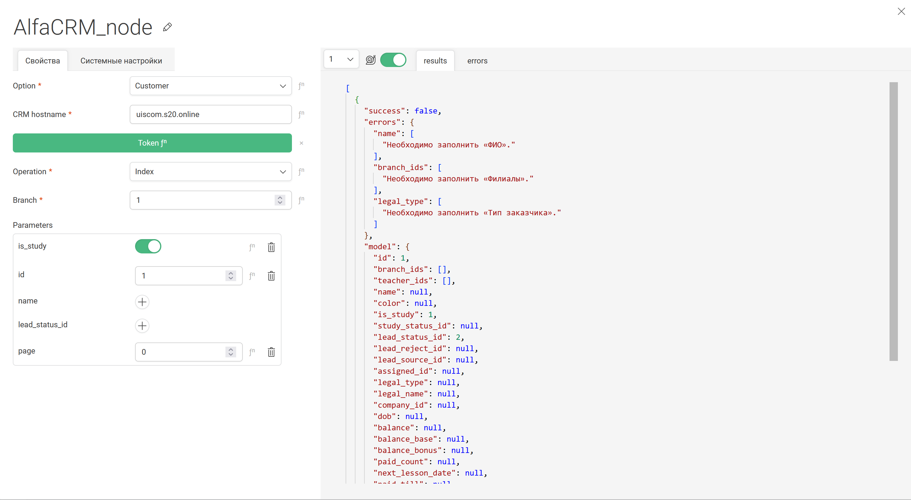

# Задание 5

Функциональное задание:
- Требуется загрузить файл на яндекс диск
- Получить плоский список всех файлов

## Результат:

Реализован кубик для взаимодействия с Яндекс Диском в интеграции с File Server

Внутри кубика можно выбрать одну из двух операций (добавить файл, получить список файлов) и ввести токен доступа пользователя. 

Интерфейс загрузки файла:
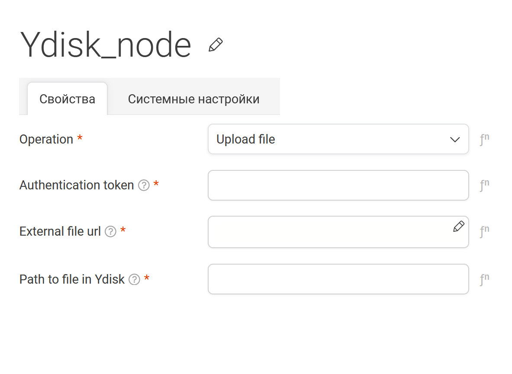
External file url берется из родительской вершины File Server. 

Интерфейс получения списка всех файлов:
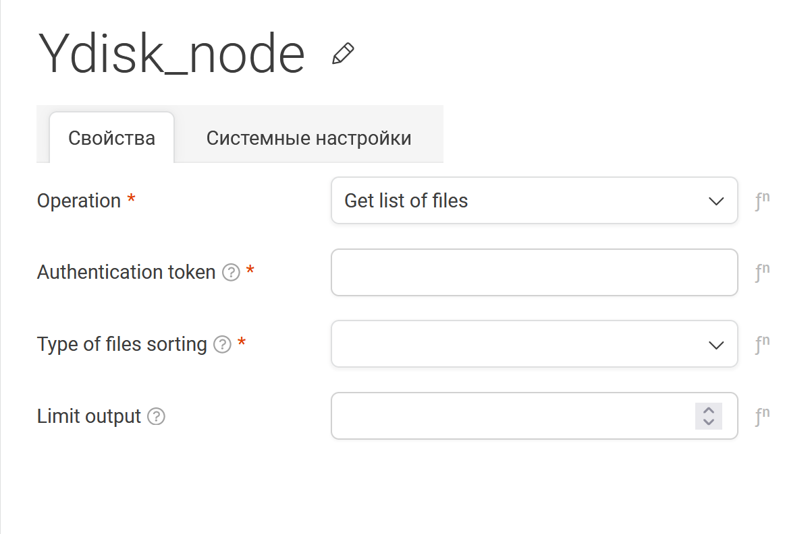
Можно выбрать сортировку файлов по имени или по дате загрузки. К тому же можно огранить количество файлов в ответе через параметр limit output.

Пример успешной операции загрузки:

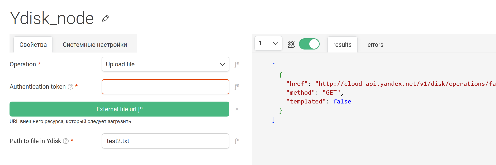

Проверила, что на диске действительно появился файл с нужным содержанием.

Пример успешной операции получения списка файлов:

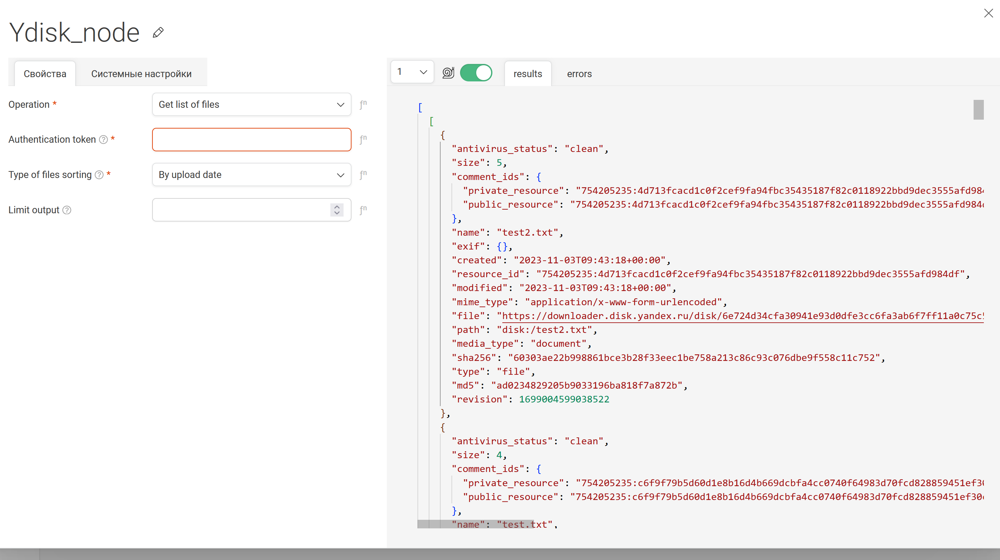

Можем увидеть, что последним как раз загружен файл, который добавили на прошлом шаге. 