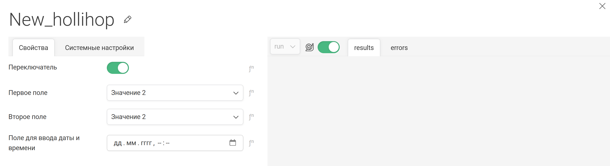

# Задание 1
Нам потребуется:
 - Docker
 - VS Code
 - Ngrok
 - Git

1. Клонируйте данный репозиторий к себе на Git.
2. Скопируйте к себе на компьютер Вашу копию даного проекта. В ней мы будем работать.
3. В файле node/service.py и node/config.yaml измените с Example на необходимые названия.
4. Запустите данный проект в VS Code, чтобы в Docker создался образ и контейнер.
5. Найдите текущий проект и его файлы в запущеном контейнере Docker.
6. Сделайте скриншот файлов которые нашли внутри контейнера и добавьте в README.md
7. Запустите Ngrok htpp на порту 9000. Сделайте его скриншот и добавьте в README.md

Ответ:

Сделала fork исходного репозитория. Изменила название с Example на TestApp.
Создала образ и запустила контейнер с проектом.

Затем установила ngrok и перенаправила запросы на 9000 порт.

Запустила код на отладку.

# Задание 2
У пользовательских полей, могут быть разные типы.

Создайте:
 1 текстовое поле
 1 числовое поле
 1 переключатель
 
 
От клиента в настроках сервиса, в тесктовое поле введите число
В числовом поле так же введите любое число.
Сервис должен вернуть сумму этих полей
Переключатель влияет на тип возвращаемых данных. Число/текст

## Результат:

Реализовала пользовательский интерфейс, где нужно ввести два числа (одно принимается как строка, другое как число) и выбрать формат ответа (строка, число).

Пример:

Ответ пользователю:

В реализации учтено, что пользователь в графе Текстовое поле может не ввести число, поэтому добавлен отдельный try-catch-else для контроля. 

# Задание 3
Основываясь на примере проекта Hollihop внесите изменение в созданный вами “кубик”.

Создайте поле - переключатель.

При положении переключателя во включено отобразите ниже два поля с выпадающим списком из двух значений (одинаковые в обоих полях):

“Значение 1”

“Значение 2”

При выборе одновременно одинаковых значений в списках отображается ниже:

“Значение 1”: Поле для ввода почты

“Значение 2”: Поле для ввода даты и времени

## Результат:

Реализовала интерфейс для "кубика" c переключателем.

При включении переключателя появляются поля для выбора значений.

При выборе "Значения 1" появляется поле для ввода email.

При выборе "Значение 2" появляется поле для ввода даты и времени

При выборе разных значений ничего не происходит.

